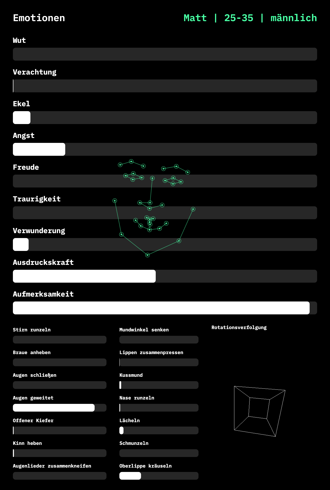

# AUI-Smart-Mirror

This code enables facial recognition, facial keypoint tracking, emotion recognition, and head-pose estimation in Javascript. It was developed as part of a smart-mirror installation, presented at the HfG Schwäbisch Gmünd in July 2019. 

Facial recognition relies on [face-api.js](https://github.com/justadudewhohacks/face-api.js/), while emotion and pose rely on [Affectiva](https://knowledge.affectiva.com/v3.3/docs/getting-started-with-the-emotion-sdk-for-javascript).

The app must be run from a local HTTP server and is designed for a 1280 x 1900 aspect ratio.

See [adaptive-ui.com](http://adaptive-ui.com/) or [matthewjoerke.com/adaptive-ui](http://matthewjoerke.com/adaptive-ui) for more details about the project.
